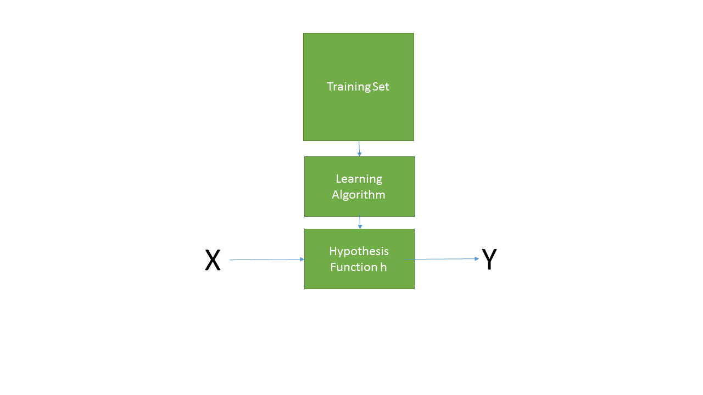

### Linear Regression
Linear regression is a linear approach for modeling the relationship between one or more continuous or discrete independent or explanatory variables and a discrete number or continuous output or dependent variable. It is the most basic type of regression and commonly used in predictive analytics. 

#### Data  
To motivate the learning process, we'll take a case study approach, in which we try to develop a machine learning application that can predict housing prices.  The data we will use was obtained from the Kaggle House Prices: Advanced Regression Techniques[@DeCock]. The training set contains 79 features $(x^{(i)})$ and prices $(y^{(i)})$ for 1460 homes in Aimes Iowa. Lets load some data, obtain some summary statistics, and render some plots. For now, we will be interested in lot area (LotArea) in square feet and the sale price (SalePrice).

```{r loadData, echo=F, message=FALSE,  eval=T, results='asis'}
prices <- read.csv("data/train.csv")
```

**Distribution of House Prices**  
The following descriptive statistics describe the house prices in terms of the number of examples $m$, the minimum and maximum house prices, the center in terms of median and mean house price, the standard deviation and standard error. We also have the first and third quartiles as well as the inter-quartile range.
```{r descriptive_prices, echo=F, message=FALSE,  eval=T}
priceStats <- prices %>% summarize(m = n(), 
                   min = min(SalePrice),
                   q1 = quantile(SalePrice, 0.25),  # first quartile, 25th percentile
                   median = median(SalePrice),
                   mean = mean(SalePrice), 
                   iqr = IQR(SalePrice),
                   q3 = quantile(SalePrice, 0.75),
                   max = max(SalePrice),
                   sd = sd(SalePrice), 
                   se = sd(SalePrice) / sqrt(n()))
```

`r kfigr::figr(label = "descStatsPrices", prefix = TRUE, link = TRUE, type="Table")`: Descriptive Statistics for House Prices
```{r descStatsPrices, echo = F, message = FALSE, warning=FALSE}
knitr::kable(priceStats) %>%  
  kableExtra::kable_styling(bootstrap_options = c("hover", "condensed", "responsive"), full_width = F, position = "center")
```

The histogram shows a nearly normal distribution of house prices, with a slight right skew.
```{r plotPrices, echo = F, message = FALSE, warning=FALSE}
hist <- ggplot2::ggplot(prices,ggplot2::aes(x=SalePrice)) +
      ggplot2::geom_histogram(fill = 'green4') +
      ggplot2::theme_minimal() +
      ggplot2::theme(text=ggplot2::element_text(family="Open Sans")) +
      ggplot2::labs(x = "House Prices")
hist
```
`r kfigr::figr(label = "plotPrices", prefix = TRUE, link = TRUE, type="Figure")`: Distribution of House Prices


**Distribution of Lot Areas**  
Similarly, we summarize the distribution of lot areas as follows:
```{r descriptive_area, echo=F, message=FALSE,  eval=T}
areaStats <- prices %>% summarize(m = n(), 
                   min = min(LotArea),
                   q1 = quantile(LotArea, 0.25),  # first quartile, 25th percentile
                   median = median(LotArea),
                   mean = mean(LotArea), 
                   iqr = IQR(LotArea),
                   q3 = quantile(LotArea, 0.75),
                   max = max(LotArea),
                   sd = sd(LotArea), 
                   se = sd(LotArea) / sqrt(n()))
```

`r kfigr::figr(label = "descStatsArea", prefix = TRUE, link = TRUE, type="Table")`: Descriptive Statistics for Lot Areas
```{r descStatsArea, echo = F, message = FALSE, warning=FALSE}
knitr::kable(areaStats) %>%  
  kableExtra::kable_styling(bootstrap_options = c("hover", "condensed", "responsive"), full_width = F, position = "center")
```

Lot areas have a nearly normal distribution with relatively few extreme outliers.

```{r plotAreas, echo = F, message = FALSE, warning=FALSE}
hist <- ggplot2::ggplot(prices,ggplot2::aes(x=LotArea)) +
      ggplot2::geom_histogram(fill = 'green4') +
      ggplot2::theme_minimal() +
      ggplot2::theme(text=ggplot2::element_text(family="Open Sans")) +
      ggplot2::labs(x = "Lot Area")
hist
```
`r kfigr::figr(label = "plotAreas", prefix = TRUE, link = TRUE, type="Figure")`: Distribution of Lot Areas

Having familiarized ourselves with the data, let's develop our intuition on the supervised learning problem, linear regression, and prediction.

#### Supervised Learning Model Representation.  
Before we launch, lets align on a few notation points: 

**Few notation points**  
1. We denote the $jth$ feature of the $ith$ training example as $x_j^{(i)}$.   
2. We denote the vector of input features for the $ith$ example as $x^{(i)}$.  
3. We denote the outcome variable for the $ith$ training example as $y^{(i)}$,   
4. A pair $(x^{(i)}, y^{(i)})$ is called a training example, and  
5. A list of $m$ training examples $(x^{(i)}, y^{(i)})$; $i = 1,...,m$, is called a *training set*.  
6. Note that the superscript $(i)$ in the notation is an index into the training set, and not an exponentiation.  
7. We will use $X$ to denote the space of input values, and $Y$ to denote the space of output values.  
8. We will denote our prediction as $\hat{Y}$.

That said, we can slightly more formally define the supervised learning problem.  Given a training set, our objective is to learn a function $h$: X$\rightarrow$Y, such that $h_\theta(x)$ is a good predictor for the corresponding value of $y$. The process of learning the hypothesis function is also referred to as fitting a linear model to the training set. This model representation is graphically depicted as follows:
```{r slm, echo=F, message=FALSE,  eval=T, results='asis', out.width='100%'}

```
`r figr("slm", TRUE, type="Figure")`: Supervised Learning Model Representation

To illustrate the process of fitting a linear model, lets examine some samples from our training data and let R regress $Y$, the sales price,  on $X$, the lot area.  

```{r scatterplot, echo = F, message = FALSE, warning=FALSE}
set.seed(23320)
idx <- sample(prices$Id, 100)
samplePrices <- subset(prices, Id %in% idx)

splot <- ggplot2::ggplot(samplePrices, ggplot2::aes(x=LotArea, y=SalePrice)) +
         ggplot2::geom_point() +
         ggplot2::theme_minimal() +
         ggplot2::geom_smooth(method=lm, se=FALSE, fullrange=TRUE)
splot
```
`r kfigr::figr(label = "scatterplot", prefix = TRUE, link = TRUE, type="Figure")`: Sales Price by Lot Area

`r kfigr::figr(label = "sampleStats", prefix = TRUE, link = TRUE, type="Table")`: Descriptive Statistics for Sample Sales Prices
```{r sampleStats, echo=F, message=FALSE,  eval=T}
sampleStats <- samplePrices %>% summarize(m = n(), 
                   min = min(SalePrice),
                   q1 = quantile(SalePrice, 0.25),  # first quartile, 25th percentile
                   median = median(SalePrice),
                   mean = mean(SalePrice), 
                   iqr = IQR(SalePrice),
                   q3 = quantile(SalePrice, 0.75),
                   max = max(SalePrice),
                   sd = sd(SalePrice), 
                   se = sd(SalePrice) / sqrt(n()))
knitr::kable(sampleStats) %>%  
  kableExtra::kable_styling(bootstrap_options = c("hover", "condensed", "responsive"), full_width = F, position = "center")
```

As indicated in `r kfigr::figr(label = "scatterplot", prefix = TRUE, link = TRUE, type="Figure")` and `r kfigr::figr(label = "sampleStats", prefix = TRUE, link = TRUE, type="Table")`above, we have 100 housing prices ranging from \$`r sampleStats$min` to \$`r sampleStats$max`, with median price at \$`r sampleStats$median` and mean \$`r sampleStats$mean`. R has fit a regression line, or *hypothesis function* $h_\theta(x)$, using the *lm* function, giving the form:
$$h_\theta(x^{(i)}) = x_0^{(i)}\theta_0 + x_1^{(i)}\theta_1 = {y^{(i)}}$$
where:   
$x_0^{(i)}$ is the intercept or *bias* term
$x_1^{(i)}$ is the *first* term,   
$\theta_0$ is the coefficient for the *bias* term which we set to 1, and  
$\theta_1$ is the coefficient for the *first* term.  

The supervised learning task in this example, is to therefore determine the optimal value of $\theta_01$ (since $\theta_0$ is conventionally set to 1) that produce a regression line that best fits the data. In essence, we develop a hypothesis of the value of $\theta_1$, we develop a cost function to evaluate our hypotheses. The best value of $\theta_1$ is that in which the cost, as per our cost function is minimized. Next we more formally define the **hypothesis function**, the **cost function**, and **gradient descent**, an algorithm for determining optimal $\theta$ that minimizes cost of function.

#### The Hypothesis Function
Given a vector of inputs $X^T$ = $X_1, X_2, ..., X_p$, our hypothesis function takes the form:
$$h_\theta(x) = \hat{\theta}_0 + \displaystyle\sum_{i=1}^{p}X_i\hat\theta_i = \hat{Y}$$.
The term $\hat{\theta_0}$ is the intercept, or *bias* term. We essentially sum the product of the vector of inputs $X_i$ and a vector of coefficients or weights, $\theta_i$, for the $ith$ to predict our outcome vector $\hat{Y}$. To vectorize the equation, we typically set $X_0$ to 1 (*the coefficient for the bias term*) and compute the *inner product*:
$$h_\theta(x) = X^T\hat{\theta} = \hat{Y}$$
Alternatively, we use matrix multiplication (*outer product*) and our hypothesis function becomes:
$$h_\theta(x) = \theta^TX = \hat{Y}$$

Therefore, the task is to determine the optimal values for vector $\hat{\theta}$, to produce a linear model that yields the best prediction. We can think of a prediction in terms of minimizing cost, the difference between our predicted value, $\hat{Y}$ and $Y$. 

#### The Cost Function
Linear regression has many techniques for fitting a linear model to training data; however, the most popular technique is the *least squares* method. With this approach, we pick the coefficients $\hat{\theta}$ that minimize the *residual sum of squares*. 
```{r rss, echo=F, message=FALSE,  eval=T, results='asis', out.width='100%'}
knitr::include_graphics('./figs/rss.png')
```
`r figr("rss", TRUE, type="Figure")`: Residuals

As shown in `r figr("rss", TRUE, type="Figure")`, the *residual* is another term for the vertical distance from our regression line to our observed value of $Y$. Since some values of $Y$ will be below our regression line, we square the difference so that all the residuals are positive.  The *residual sum of squares* formulation is as follows:
$$RSS(\theta) = \displaystyle\sum_{i=1}^{m}(h_\theta(x^{(i)}) - y^{i})^2$$
The cost function is a generalization of the residual sum of squares formulation. Specifically we take *half of the average* residual sum of squares. This is a mathematical convenience for the computation of hte gradient descent, an algorithm used to minimize the cost function.  The derivative term of the square function will cancel out the $1/2$ term.  Therefore our linear regression **cost function**, denoted as $J(\theta)$, is as follows:
$$J({\theta}) = 1/2m\displaystyle\sum_{i=1}^{m}h_{\theta}(x^{(i)})- y^{(i)})^2$$

where: $m$ is the number of training examples and $i$ indicates the $ith$ training example. 

To find optimal $\theta_0$ and $\theta_1$, our task is to determine $\theta_0$ and $\theta_1$ that minimize cost function $J(\theta)$. Ideally, the best line would fit through all the points of our training data set, such that the value of $J(\theta_0,\theta_1)$ will be 0. The following example illustrates a cost function of 0.


```{r 0cost, echo = F, message = FALSE, warning=FALSE}
prices <- c(180000, 270000, 405000)
areas <- c(10500, 15750, 23625)
priceData <- data.frame(prices = prices, areas = areas)
m <- lm(prices ~ areas, priceData)

lm_eqn <- function(m){
    eq <- substitute(italic(y) == a + b %.% italic(x)*","~~italic("J")~"="~J, 
         list(a = round(coef(m)[1], digits = 2), 
              b = round(coef(m)[2], digits = 2), 
              J = round(residuals(m)[1]^2, digits = 3)))
    as.character(as.expression(eq));                 
}
coord = data.frame(x = mean(priceData$areas) + 2500, y = mean(priceData$prices) + 2510)


splot <- ggplot2::ggplot(priceData, ggplot2::aes(x=areas, y=prices)) +
         ggplot2::geom_point() +
         ggplot2::theme_minimal() +
         ggplot2::theme(legend.position = "none") +
         ggplot2::geom_smooth(method=lm, se=FALSE, fullrange=TRUE) +
         ggplot2::geom_text(x = coord$x, y = coord$y, label = lm_eqn(m), parse = TRUE) +
         ggplot2::geom_point(aes(colour = "red", size = 17.5))
splot
```
`r kfigr::figr(label = "0cost", prefix = TRUE, link = TRUE, type="Figure")`: Regression Line with Zero Cost

When $theta_0 \approx 0$  $theta_1 = 17.14$, our cost function is zero; however, if we change the data a bit, we get a new regression line with non-zero cost.

```{r cost, echo = F, message = FALSE, warning=FALSE}
prices <- c(180000, 270000, 405000)
areas <- c(10500, 13125, 23000)
priceData <- data.frame(prices = prices, areas = areas)
m <- lm(prices ~ areas, priceData)
yhat <- m$fitted.values

lm_eqn <- function(m){
    eq <- substitute(italic(y) == a + b %.% italic(x)*","~~italic("J")~"="~J,  
         list(a = round(coef(m)[1], digits = 2), 
              b = round(coef(m)[2], digits = 2), 
              J = round(residuals(m)[1]^2, digits = 3)))
    as.character(as.expression(eq));                 
}
coord = data.frame(x = 1.2 * min(priceData$areas) + 2500, y = 0.9 * max(priceData$prices) + 2510)


splot <- ggplot2::ggplot(priceData, ggplot2::aes(x=areas, y=prices)) +
         ggplot2::geom_point() +
         ggplot2::theme_minimal() +
         ggplot2::theme(legend.position = "none") +
         ggplot2::geom_smooth(method=lm, se=FALSE, fullrange=TRUE) +
         ggplot2::geom_text(x = coord$x, y = coord$y, label = lm_eqn(m), parse = TRUE) +
         ggplot2::geom_point(aes(colour = "red", size = 17.5)) +
         ggplot2::geom_segment(aes(x=areas, xend=areas, y=prices, yend=yhat, color="error"))+
       labs(title="Regresssion Line Costs", color="series")
splot
```
`r kfigr::figr(label = "cost", prefix = TRUE, link = TRUE, type="Figure")`: Regression Line with Cost

Here with, $theta_0 = $ `round(coef(m)[1]`, and $theta_1 = $ `round(coef(m)[2]`, we observe a cost of $J(\theta_0,\theta_1) = $ `round(residuals(m)[1]^2,2)`
